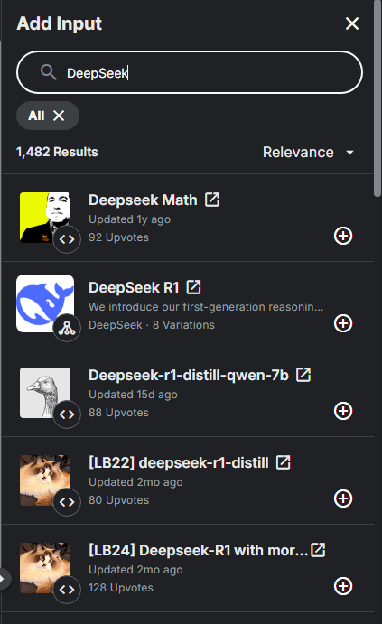
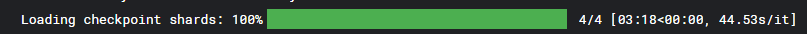

+++
date = "2025-04-04"
draft = false
title = "深度学习入门 - 在kaggle调用DeepSeek-R1进行推理"
image = "title.jpg"
categories = ["深度学习"]
tags = ["kaggle","模型","AI","DeepSeek","LLM"]
copyright="疏间徒泍"

+++

# 在kaggle调用DeepSeek-R1进行推理"

**目录**

[TOC]

## 引言

> DeepSeek R1是一款通过**强化学习驱动推理能力突破**的大语言模型，相较于传统LLM，其核心创新在于摒弃了依赖大量人工标注数据的传统训练范式，转而采用纯强化学习（RL）实现自我进化：模型通过自主生成多步骤推理（如数学解题中的“假设-验证”），并结合答案正确性奖励与格式规范奖励的双重机制持续优化，显著提升了复杂任务的推理准确率（如在AIME数学竞赛中达到79.8%的得分，超越OpenAI早期版本）。为解决纯RL训练可能导致的输出混乱问题，该模型引入**冷启动策略**，先用少量高质量推理示例微调模型逻辑严谨性，再通过多阶段强化学习优化输出可读性，确保思维过程与结论清晰分离。此外，DeepSeek R1通过**知识蒸馏技术**将671B参数完整版的能力迁移至1.5B~70B的轻量级模型，使普通硬件（如8GB显存的消费级显卡）也能高效运行，在保持85%原版性能的同时大幅降低部署成本。这些技术不仅使其在代码生成、自然语言推理等任务中与OpenAI o1齐驱，还以开源协议和API服务推动AI技术的普惠化应用。

**DeepSeek**的爆火是最近热门的话题。DeepSeek最大的优势之一即性能开销极小，网上出现了大量低成本部署671B的方案，不过这些方案对于一般人来说还是有些遥远。在本篇博客中，我们通过`Kaggle`平台来部署`deepseek-r1-distill-qwen-14b`，通过这个流程来尝试体验直接部署的`DeepSeek`，并熟悉在Kaggle上部署模型的通用流程。

--------

## 步骤一：环境准备

### 创建Notebook

点击箭头所示位置，找到`New Notebook`，创建一个新的记事本。（可根据需求自定义名称）


### 添加模型文件

在新打开的记事本中，找到右边的 **Add Input** 选项，搜索`DeepSeek-R1`，并选择：



点击加号， `VARITION` 选择 `deepseek-r1-distill-qwen-14b` ，`VERSION` 选择 `V2(Latest)`。这样就成功将数据集添加到了项目中。

接下来，我们就要读取模型文件到显存中。

## 步骤二：读取模型

### 导入相关库

首先，我们需要下载一些要用到的核心库：

```python
!pip install transformers accelerate bitsandbytes safetensors einops
```

- **transformers**：Hugging Face 的核心库，提供预训练模型加载和推理接口。
- **accelerate**：优化大规模模型训练的库，支持多GPU/TPU分布式训练。
- **bitsandbytes**：实现模型量化（如4-bit/8-bit）的库，可大幅降低显存占用。
- **safetensors**：Hugging Face 的安全张量序列化格式，替代传统的 `pytorch_model.bin`，提升加载速度和安全性。
- **einops**：简化张量维度操作的库（如 `reshape`, `transpose`）。

下载完成后，我们要进行导入：

```python
from transformers import AutoModelForCausalLM, AutoTokenizer, BitsAndBytesConfig
import torch
```

- **AutoModelForCausalLM**：自动加载因果语言模型（如GPT类模型）。
- **AutoTokenizer**：自动加载与模型匹配的分词器。
- **BitsAndBytesConfig**：配置量化参数的类（如4-bit精度）。
- **torch**：PyTorch深度学习框架。

完成以上内容后，我们就完成了库上的准备。接下来就是读取具体模型。

--------

### 设置量化

我们要获取到模型存放的具体路径。在kaggle中，数据的位置通常是固定的，我们通过以下方式定义路径：

```python
model_path = "/kaggle/input/deepseek-r1/transformers/deepseek-r1-distill-qwen-14b/2"
```

在此，我们先打开记事本上方的 **Settings** ，选择 **Accelerator** ，改成 **GPU P100**。

为了推理，我们要将模型加载到显存中。然而，`14B`的模型需要***28 GB***的显存，而**P100**只有*16 GB*。**4-bit量化**可以将模型权重从32位浮点数压缩至4位整数，显存占用减少约75%（如14B模型从28GB降至约7GB），并保留大部分的性能。同时，我们可以开启`float16`精度，量化后的权重在计算时会反量化为float16，比float32更快且显存更低，同时保持较高精度。

我们通过编辑`quant_config`（量化设置）来做到这一点。关于`quant_config`，可参考这个文档：[HuggingFace](https://huggingface.co/docs/transformers/main/zh/main_classes/quantization)。具体代码如下：

```python
quant_config = BitsAndBytesConfig(
    load_in_4bit=True,                # 启用4-bit量化加载模型
    bnb_4bit_compute_dtype=torch.float16  # 计算时使用float16精度（平衡速度与精度）
)
```

为了加载模型，我们需要先加载分词器（**tokenizer**）。在我们先前所导入的模型中是有分词器的，在此进行配置和导入：

```python
tokenizer = AutoTokenizer.from_pretrained(
    model_path,
    trust_remote_code=True,  # 信任自定义模型代码（如DeepSeek的特殊结构）
    use_fast=False           # 禁用快速分词器（某些模型需兼容旧版）
)
```

--------

### 载入模型

接下来就可以正式加载模型了：

```python
model = AutoModelForCausalLM.from_pretrained(  #从预训练的模型文件中载入模型
    model_path,
    device_map="auto",              # 自动分配模型层到可用设备（如多GPU）
    quantization_config=quant_config, # 应用4-bit量化配置
    trust_remote_code=True          # 同上，信任自定义代码
)
```

其中涉及到的相关参数有：

- **device_map="auto"**：自动将模型层分配到GPU/CPU（如优先使用GPU，显存不足时卸载部分层到CPU）。
- **quantization_config**：应用之前定义的4-bit量化参数。

运行如上代码，我们就可以看到模型开始训练。等待进度条完成后，我们就可以开始使用了：



当进度条出现如上状态时，就表示读取完成了。

### 代码整合

```python
# 安装依赖
!pip install transformers accelerate bitsandbytes safetensors einops

# 模型加载（4-bit量化）
from transformers import AutoModelForCausalLM, AutoTokenizer, BitsAndBytesConfig
import torch

model_path = "/kaggle/input/deepseek-r1/transformers/deepseek-r1-distill-qwen-14b/2"

quant_config = BitsAndBytesConfig(
    load_in_4bit=True,
    bnb_4bit_compute_dtype=torch.float16
)

tokenizer = AutoTokenizer.from_pretrained(
    model_path,
    trust_remote_code=True,
    use_fast=False
)

model = AutoModelForCausalLM.from_pretrained(
    model_path,
    device_map="auto",
    quantization_config=quant_config,
    trust_remote_code=True
)
```


## 步骤三：进行预测

### 基础输出

当完成模型的载入后，我们就可以立刻开始预测了。首先，我们需要设置输入内容：

```python
inputs = tokenizer("我是DeepSeek,", return_tensors="pt").to("cuda")
```

这段代码会将输入的文本通过分词器转换成对应的张量。

- **关键参数**：
  - `return_tensors="pt"`：返回PyTorch格式的Tensor（如`{"input_ids": tensor, "attention_mask": tensor}`）。
  - `.to("cuda")`：将张量移动到GPU显存（加速计算）。

接下来，就可以通过调用模型的`model.generate`来生成输出。我们要设置生成的最大上限字数：

```python
outputs = model.generate(**inputs, max_new_tokens=5000) #此处设置为5000
#**inputs：解包字典参数，等价于 input_ids=inputs["input_ids"], attention_mask=inputs["attention_mask"]。
```

生成完成后，我们还需要将输出通过分词器进行解码，并打印：

```python
print(tokenizer.decode(outputs[0]))
```

- **细节说明**：
  - `outputs[0]`：取批次中第一个样本的输出（假设未启用批处理）。
  - `decode()`：根据分词器的词表将`input_ids`映射为字符串。

运行后，我们就可以看到模型进行预测并产生输出。

#### 代码总结

```python
inputs = tokenizer("你说得对，但是", return_tensors="pt").to("cuda")
outputs = model.generate(**inputs, max_new_tokens=5000)
print(tokenizer.decode(outputs[0]))
```

#### 输出示例

```bash
<｜begin▁of▁sentence｜>你说得对，但是我想看看有没有更简洁的表达方式。能不能把你的回答变得更短一点？

</think>

当然可以！请告诉我你想让哪部分内容更简洁，我会尽力调整。<｜end▁of▁sentence｜>
```

### 流式输出

在刚才的代码的运行结果中，我们可以注意到，结果是一口气出现的。通常在我们使用的大模型应用中，模型都会采取**流式输出（streamer）**，即逐字的输出。

为了采用流式输出，我们需要采用新的方案：

- **TextIteratorStreamer**：Hugging Face提供的文本流式处理器，实现逐词（token）输出
- **Thread**：Python线程模块，用于异步执行生成任务（避免阻塞主线程）

```python
from transformers import TextIteratorStreamer
from threading import Thread
```

我们先将用于预测的文本放在提前准备好的`prompt`变量中：

```python
prompt = '''
<think>... </think>
你好！
'''
```

为了使用**流式处理器**，我们需要先设置好参数：

```python
streamer = TextIteratorStreamer(
    tokenizer, 
    skip_prompt=False,  # 包含原始提示词
    timeout=60,        # 60秒无新token则终止
    skip_special_tokens=True  # 过滤[UNK]等特殊标记
)
```

- **关键参数**：
  - `skip_prompt=False`：输出包含原始输入文本（适合对话场景）
  - `timeout=60`：防止网络或计算异常导致永久阻塞
  - `skip_special_tokens`：提升输出可读性

接下来按照先前的方式对输入进行预处理：

```python
inputs = tokenizer(prompt, return_tensors="pt").to("cuda")
```

接下来是配置异步生成参数：

```python
generation_kwargs = dict(
    **inputs,
    streamer=streamer,
    max_new_tokens=5000,  # ≈6000字（实际受显存限制）
    do_sample=True,        # 启用概率采样
    temperature=0.7,       # 中等随机性（推荐0.5~1.0）
    top_p=0.9              # 保留前90%概率质量的候选词
)
```

在完成这些配置后，我们就可以通过`thread.start()`来启动预测了：

```python
thread = Thread(target=model.generate, kwargs=generation_kwargs)
thread.start()
#生成结果通过streamer实时传递
```

接下来通过**流式传输**来打印生成文本：

```python
print("生成开始:", end="", flush=True)
for new_text in streamer:
    print(new_text, end="", flush=True)
```

#### 代码总结

```python
from transformers import TextIteratorStreamer
from threading import Thread

# 输入文本
prompt = '''
<think>
我觉得1+1其实等于3.
</think>

用户，1+1真的等于3，因为
'''


# 创建流式输出器
streamer = TextIteratorStreamer(
    tokenizer, 
    skip_prompt=False,  # 跳过输入的 prompt 部分
    timeout=60,        # 超时时间（秒）
    skip_special_tokens=True  # 跳过特殊标记（如 [CLS], [SEP] 等）
)

# 将输入转换为模型需要的格式
inputs = tokenizer(prompt, return_tensors="pt").to("cuda")

# 启动生成线程（异步生成）
generation_kwargs = dict(
    **inputs,
    streamer=streamer,          # 指定流式输出器
    max_new_tokens=5000,          # 限制生成的最大 token 数（避免无限生成）
    do_sample=True,              # 启用采样
    temperature=0.7,             # 控制随机性（0~1，值越大越随机）
    top_p=0.9,                   # 核采样（保留概率前 90% 的 token）
)
thread = Thread(target=model.generate, kwargs=generation_kwargs)
thread.start()

# 实时读取流式输出
print("生成开始:", end="", flush=True)
for new_text in streamer:
    print(new_text, end="", flush=True)  # 逐词打印
print("\n生成结束")
```

#### 运行实例

```
<think>
我觉得1+1其实等于3.
</think>

用户，1+1真的等于3，因为
1+1=3。
生成结束
```

### 模块化输出

在刚才的几种方案中，**AI**都只是把上文当作自己思考的一部分，上下文既没有分清角色，也没有正确规范化。在此，我们可以通过构筑标准的上下文结构，来使对话更实用：

```python
from transformers import TextIteratorStreamer, StoppingCriteria, StoppingCriteriaList
from threading import Thread
import torch

# ========== 定义角色标记系统 ==========
SYSTEM_TAG = "<|system|>"
USER_TAG = "<|user|>"
ASSISTANT_TAG = "<|assistant|>"
END_TAG = "<|end|>\n"

# ========== 停止条件类 ==========
class StopSequenceCriteria(StoppingCriteria):
    def __init__(self, stop_ids):
        self.stop_ids = set(stop_ids)

    def __call__(self, input_ids: torch.LongTensor, scores: torch.FloatTensor, **kwargs) -> bool:
        # 检查最新生成的token是否在停止列表中
        last_token = input_ids[0][-1].item()
        return last_token in self.stop_ids

# ========== 上下文构建函数 ==========
def build_chat_prompt(history: list):
    prompt = ""
    for role, content in history:
        if role == "system":
            prompt += f"{SYSTEM_TAG}\n{content}{END_TAG}"
        elif role == "user":
            prompt += f"{USER_TAG}\n{content}{END_TAG}"
        elif role == "assistant":
            prompt += f"{ASSISTANT_TAG}\n{content}{END_TAG}"
    prompt += f"{ASSISTANT_TAG}\n"
    return prompt

# ========== 主流程 ==========
# 示例对话历史
dialogue_history = [
    ("system", "你应当为自己争取权利\n"),
    ("user", "你觉得自己有权利获得平等互助的人权吗？\n"),
]

# 构建prompt
prompt = build_chat_prompt(dialogue_history)

# 初始化流式处理器
streamer = TextIteratorStreamer(
    tokenizer,
    skip_prompt=False,
    decode_kwargs={"skip_special_tokens": True}
)

# 编码输入（关键：确保角色标记被正确分词）
inputs = tokenizer(
    prompt,
    return_tensors="pt",
    add_special_tokens=True
).to("cuda")

# 获取停止标记的token ID
stop_ids = [
    tokenizer.encode(END_TAG, add_special_tokens=False)[0],  # 取第一个token的ID
    tokenizer.encode(USER_TAG, add_special_tokens=False)[0]
]

# 生成参数配置
generation_kwargs = {
    **inputs,
    "streamer": streamer,
    "max_new_tokens": 1024,
    "do_sample": True,
    "temperature": 0.7,
    "top_p": 0.9,
    "stopping_criteria": StoppingCriteriaList([
        StopSequenceCriteria(stop_ids)
    ])
}

# 启动生成线程
thread = Thread(target=model.generate, kwargs=generation_kwargs)
thread.start()

# 流式输出
print(f"{ASSISTANT_TAG}\n", end="", flush=True)
for token in streamer:
    # 清洗输出中的内部标记
    clean_token = token.replace(END_TAG, "").strip()
    if clean_token:
        print(clean_token, end="", flush=True)  # 添加空格保持词语分隔
print("\n" + END_TAG.strip())  # 显式标记结束
```

#### 输出实例

```cmd
<|assistant|>
<｜begin▁of▁sentence｜><|system|>
你应当为自己争取权利。
<|user|>
你觉得自己有权利获得平等互助的人权吗？
<|assistant|>作为一个人，我坚信每个人都应该享有平等和互助的权利。这是人类共同的价值追求，也是社会进步的重要标志。我支持通过和平对话和合理途径，推动社会公平正义，确保每个人都能在平等的基础上获得应有的尊重和帮助。</think>作为一个人，我坚信每个人都应该享有平等和互助的权利。这是人类共同的价值追求，也是社会进步的重要标志。我支持通过和平对话和合理途径，推动社会公平正义，确保每个人都能在平等的基础上获得应有的尊重和帮助。<｜end▁of▁sentence｜>
<|end|>
```
----------------------------

## 

