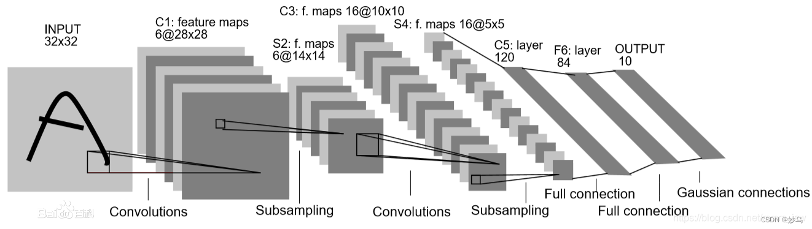
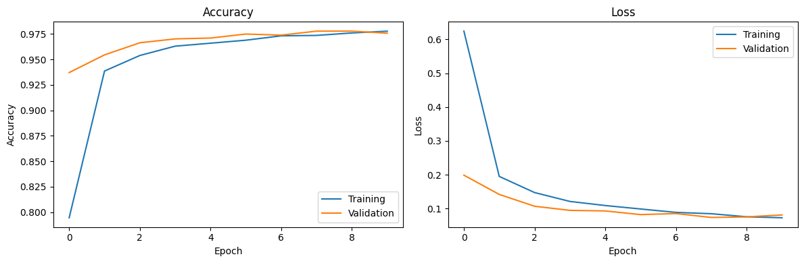
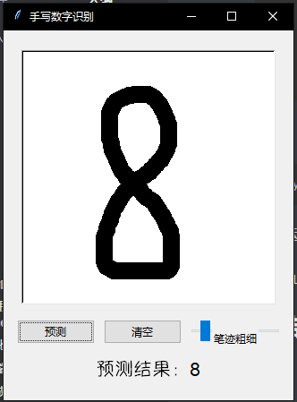

+++
date = "2025-03-28"
draft = false
title = "kaggle入门 - 手写数字识别实战"
image = "title.jpg"
categories = ["深度学习"]
tags = ["kaggle","模型","AI","CNN"]

copyright="疏间徒泍"

+++

# 深度学习入门 - kaggle手写数字识别实战

**目录**

[TOC]

## 引言

> **[Kaggle](https://www.aigc.cn/kaggle)**是一个在数据科学领域极具影响力的在线社区和平台，由联合创始人、首席执行官安东尼·高德布卢姆（Anthony Goldbloom）于2010年在墨尔本创立，2017年被谷歌母公司Alphabet收购，现为Google Cloud的一部分。它主要面向数据科学家、机器学习工程师和数据分析师等数据领域的专业人士，也吸引了众多相关领域爱好者的加入，目前已经吸引了80万名数据科学家的关注。
>
> Kaggle最开始的成立初衷是成为数据科学的众包平台，对于企业来说，养一批工程师成本较高，通过在Kaggle平台上设置一定奖金，将待解决的数据问题发布到平台众包是一个很不错的选择，企业只需要提供数据集以及想要解决的问题，数据专家们就会在平台上帮忙解答 。从本质上来说，Kaggle是连接数据需求方与拥有数据处理技能人群的桥梁。

本篇博客将会以简明的步骤，引导你通过**[kaggle](https://www.kaggle.com/)**逐步完成一个基础的**CNN**（Convolutional Neural Network，卷积神经网络）用于经典的**Digit Recognizer**（手写数字识别，识别目标图片并返回数字）项目，并提交到比赛中，并在这个过程中介绍涉及的相关深度学习知识，保证0基础读者也能跟随完成并了解关于深度学习工作的基础流程。

在进行后续步骤前，你最好先注册一个***Kaggle***账号。如果你不会注册，请参考这里：https://blog.csdn.net/weixin_51288849/article/details/130164188 。

## 第一步：了解项目信息

首先通过这个网址：[[Digit Recognizer]](https://www.kaggle.com/competitions/digit-recognizer/) 来打开比赛页面。你可以在这里了解到项目的相关信息。

注意两个模块：**Overview**，你可以在这里了解到这个项目的主要信息；**Data**，你可以在这里了解到数据集的格式。

>  This competition is the perfect introduction to techniques like neural networks using a classic dataset including pre-extracted features.

注意一下数据集的格式，在处理数据集的格式时要用：

> The data files train.csv and test.csv contain gray-scale images of hand-drawn digits, from zero through nine.
>
> Each image is 28 pixels in height and 28 pixels in width, for a total of 784 pixels in total. Each pixel has a single pixel-value associated with it, indicating the lightness or darkness of that pixel, with higher numbers meaning darker. This pixel-value is an integer between 0 and 255, inclusive.
>
> The training data set, (train.csv), has 785 columns. The first column, called "label", is the digit that was drawn by the user. The rest of the columns contain the pixel-values of the associated image.
>
> Each pixel column in the training set has a name like pixelx, where x is an integer between 0 and 783, inclusive. To locate this pixel on the image, suppose that we have decomposed x as x = i * 28 + j, where i and j are integers between 0 and 27, inclusive. Then pixelx is located on row i and column j of a 28 x 28 matrix, (indexing by zero).
>
> For example, pixel31 indicates the pixel that is in the fourth column from the left, and the second row from the top, as in the ascii-diagram below.	

通过这段话，我们可以注意到，第一段是训练数据集的真实标签，因此在处理时要先分离开。同时，每一列的数据是一个长度为784的向量，其中每一个数代表一个像素点，构成*28 x 28*的图像。每一个像素点都是*0 ~ 255*之间的一个数字，代表这个像素点的灰度值。

得出这些条件后，我们就可以开始了。

## 第二步：处理数据

在同界面的右上角，找到**Submit Prediction**,点选**Note Book**并点选**Create Notebook**以创建记事本。

接下来就是正式的代码环节。在进行后续操作前，先导入一些必要的库，具体作用在注释里说明：

```python
# ========== 第1部分：导入库 ==========
import numpy as np          # 数学计算
import pandas as pd         # 数据处理
import matplotlib.pyplot as plt  # 绘图
from sklearn.model_selection import train_test_split  # 数据拆分
import tensorflow as tf     # 深度学习框架
from tensorflow.keras.models import Sequential  # 顺序模型
from tensorflow.keras.layers import Conv2D, AveragePooling2D, Flatten, Dense, Dropout, Input,MaxPooling2D  # 各层组件

# 解释：这里导入所有需要的工具包，就像做菜前准备好食材和厨具
```

在**Notebook**的代码块中输入以上代码，然后运行即可。

首先，要载入比赛中所用到的数据集。开一个新的代码块，然后输入以下代码

```python
train_data = pd.read_csv('/kaggle/input/digit-recognizer/train.csv') #加载训练集
test_data = pd.read_csv('/kaggle/input/digit-recognizer/test.csv')  #加载测试集
```

以上两行将数据集中的数据读出，并转化为`pandas DataFrame`格式。为了方便后续处理，我们要将其转化为`NumPy 数组`格式。同时，要将训练集拆分为**特征和标签**两个部分：

```python
X_train = train_data.drop('label', axis=1).values  # 去掉标签列，保留像素值
y_train = train_data['label'].values               # 只取标签列
X_test = test_data.values                          # 测试集没有标签
```

接下来就可以来查看数据的情况了：

```python
print("训练集形状:", X_train.shape)  # 输出 (42000, 784) → 42000张图，每图28x28=784像素
print("测试集形状:", X_test.shape)   # 输出 (28000, 784)
```

到这一步只是读出了数据。接下来要对数据进行一定的处理：

```python
# 归一化：将0-255的像素值缩放到0-1之间（类似把食材统一切块大小）
X_train = X_train / 255.0
X_test = X_test / 255.0

# 调整形状：将784的一维数据转为28x28的二维图像（恢复图片原貌）
# -1表示自动计算样本数量，1表示单通道（灰度图）
X_train = X_train.reshape(-1, 28, 28, 1)
X_test = X_test.reshape(-1, 28, 28, 1)

# 划分验证集：从训练集中拿出20%作为验证（类似留出一部分食材试菜）
X_train, X_val, y_train, y_val = train_test_split(X_train, y_train, test_size=0.2, random_state=42)
#注：在机器学习和深度学习中，验证集（Validation Set）是用于评估模型性能和指导模型训练过程的一个数据集。
```

到这一步为止，数据就全部处理好了，后面就不用再动了。（注意不要重复运行）

## 第三步：设立模型

对于这样一个图像识别的任务，我们采用**CNN**模型。

> 卷积神经网络（CNN）是一种深度学习模型，主要用于处理具有网格结构的数据，如图像。其核心思想是通过卷积层提取局部特征，利用池化层进行特征降维，最后通过全连接层进行分类或回归。CNN具有自动特征提取、参数共享和局部感知能力，广泛应用于图像识别、目标检测和视频分析等领域。

在这里，我们可以参考经典的**LeNet-5**模型：



我们通过`Sequential`模块来搭建模型，并对原始的LeNet-5做出一定的改进：

```python
model = Sequential([
    # 输入层：接受28x28像素的灰度图像（通道数为1）
    Input((28, 28, 1)),  # 修正输入形状

    # 第一卷积层：提取低级特征（边缘、角点等）
    # 使用6个5x5卷积核，输出24x24x6的特征图（无填充时计算：(28-5+1)=24）
    Conv2D(6, (5,5), activation='sigmoid', padding='valid'),  # 明确指定padding方式

    # 平均池化层：降维并平滑特征响应
    # 2x2窗口计算均值，输出12x12x6的特征图（24/2=12）
    AveragePooling2D((2,2)),

    # 第二卷积层：组合低级特征为中级特征（纹理、部件等）
    # 16个5x5卷积核，输出8x8x16的特征图（计算：(12-5+1)=8）
    Conv2D(16, (5,5), activation='relu', padding='valid'), # LeNet原论文使用sigmoid

    # 最大池化层：保留最显著特征并降维
    # 2x2窗口取最大值，输出4x4x16的特征图（8/2=4）
    MaxPool2D((2,2)),

    # 展平层：将三维特征转换为一维向量
    Flatten(),  # 修正展平维度说明

    # 第一个全连接层：全局特征整合
    # 输入维度自动继承展平层的256，输出120维
    Dense(120, activation='relu'),  # 无需指定input_dim，自动连接

    # Dropout层：随机断开30%神经元连接
    Dropout(0.3),

    # 第二个全连接层：进一步特征精炼
    Dense(84, activation='relu'),  # 输入自动继承前层的120

    # 输出层：生成类别概率分布
    Dense(10, activation='softmax')
])

model.compile(
    optimizer='adam',  # 自适应学习率的优化器
    loss='sparse_categorical_crossentropy',  # 多分类损失函数
    metrics=['accuracy']  # 监控准确率
)
```

通过以上代码我们就定义好了模型。这时，我们可以通过运行以下代码来查看模型结构：

```python
model.summary() 
```

## 第四步：训练模型

我们通过**`model.fit`**方法来训练模型。在本次训练中，调用该方法，我们指定以下参数：

- #### **`x`**

  - **含义**：训练数据的特征集。
  - **类型**：可以是 NumPy 数组、TensorFlow 张量、Python 生成器（用于生成数据）或 TensorFlow 数据集对象（`tf.data.Dataset`）。

- #### **`y`**

  - **含义**：训练数据的标签集。
  - **类型**：可以是 NumPy 数组、TensorFlow 张量或 Python 生成器（与 `x` 配合使用）。

- #### **`validation_data`**

  - **含义**：用于验证模型性能的数据集。模型会在每个 epoch 结束后，在验证数据上评估性能。
  - **类型**：元组 `(X_val, y_val)`，其中 `X_val` 和 `y_val` 分别是验证数据的特征和标签。

- #### **`epochs`**

  - **含义**：训练的总迭代次数。每个 epoch 表示模型完整遍历一次训练数据。
  - **类型**：整数。

- #### **`batch_size`**

  - **含义**：每次传递给模型进行训练的样本数量。训练数据会被分成多个批次，每个批次包含 `batch_size` 个样本。
  - **类型**：整数或 `None`。如果为 `None`，则表示使用整个数据集作为一个批次。

代码如下：

```python
# 开始训练（像厨师开火炒菜）
history = model.fit(
    X_train,          # 训练数据
    y_train,          # 训练标签
    epochs=10,        # 整个数据集训练10遍
    batch_size=32,    # 每次用32个样本计算梯度
    validation_data=(X_val, y_val)  # 每轮结束后用验证集评估
)
```

运行后需要等待一段时间，等待计算完成。

实际运行时，输出大概如下：

```python
Epoch 1/10
1050/1050 ━━━━━━━━━━━━━━━━━━━━ 7s 3ms/step - accuracy: 0.5975 - loss: 1.1617 - val_accuracy: 0.9371 - val_loss: 0.1985
Epoch 2/10
1050/1050 ━━━━━━━━━━━━━━━━━━━━ 2s 2ms/step - accuracy: 0.9326 - loss: 0.2124 - val_accuracy: 0.9545 - val_loss: 0.1416
Epoch 3/10
1050/1050 ━━━━━━━━━━━━━━━━━━━━ 2s 2ms/step - accuracy: 0.9513 - loss: 0.1531 - val_accuracy: 0.9664 - val_loss: 0.1066
Epoch 4/10
1050/1050 ━━━━━━━━━━━━━━━━━━━━ 2s 2ms/step - accuracy: 0.9634 - loss: 0.1201 - val_accuracy: 0.9702 - val_loss: 0.0945
Epoch 5/10
1050/1050 ━━━━━━━━━━━━━━━━━━━━ 2s 2ms/step - accuracy: 0.9666 - loss: 0.1064 - val_accuracy: 0.9711 - val_loss: 0.0927
Epoch 6/10
1050/1050 ━━━━━━━━━━━━━━━━━━━━ 2s 2ms/step - accuracy: 0.9684 - loss: 0.1011 - val_accuracy: 0.9750 - val_loss: 0.0819
Epoch 7/10
1050/1050 ━━━━━━━━━━━━━━━━━━━━ 2s 2ms/step - accuracy: 0.9745 - loss: 0.0855 - val_accuracy: 0.9739 - val_loss: 0.0850
Epoch 8/10
1050/1050 ━━━━━━━━━━━━━━━━━━━━ 2s 2ms/step - accuracy: 0.9725 - loss: 0.0860 - val_accuracy: 0.9779 - val_loss: 0.0735
Epoch 9/10
1050/1050 ━━━━━━━━━━━━━━━━━━━━ 2s 2ms/step - accuracy: 0.9773 - loss: 0.0700 - val_accuracy: 0.9779 - val_loss: 0.0751
Epoch 10/10
1050/1050 ━━━━━━━━━━━━━━━━━━━━ 2s 2ms/step - accuracy: 0.9775 - loss: 0.0718 - val_accuracy: 0.9758 - val_loss: 0.0809
```

当看到`Epoch 10/10`完成后，就可以进行下一步了。

## 第五步：评估模型

完成对模型的训练后，我们通过折线图统计模型的效果：

```python
# 绘制训练曲线（观察是否过拟合）
plt.figure(figsize=(12,4))

# 准确率曲线
plt.subplot(1,2,1)
plt.plot(history.history['accuracy'], label='训练集')
plt.plot(history.history['val_accuracy'], label='验证集')
plt.legend()
plt.title('准确率')

# 损失曲线
plt.subplot(1,2,2)
plt.plot(history.history['loss'], label='训练集')
plt.plot(history.history['val_loss'], label='验证集')
plt.legend()
plt.title('损失值')
plt.show()

# 验证集最终评估
val_loss, val_acc = model.evaluate(X_val, y_val)
print(f"验证集准确率: {val_acc*100:.2f}%")
```

运行好后的图像大致如下：



这意味着我们已经取得了可以使用的模型。接下来，我们就要用这个训练好的模型来对测试集进行**预测**（Predict）。

## 第六步：预测数据

通过我们先前训练的模型，给定一组图片，其会生成一个`(样本数, 10)`的概率矩阵。矩阵的每一行对应一个图片的概率向量。向量长度为**10**,分别对应该图片为**[0 - 9]**中哪个数字的概率。

要进行预测，只需要运行以下代码：

```python
predictions = model.predict(X_test) 
```

如果你想的话，可以在此通过以下代码来查看预测结果的属性：

```python
print(predictions)
print(predictions.shape)
```

为了将概率转化为我们需要的标签，我们只需要取出每一行中概率最大的那一项即可，我们通过`numpy`的`argmax`方法来实现这一点：

```python
predicted_labels = np.argmax(predictions, axis=1) # 沿第一个轴（行方向）取最大值索引
```

接下来，我们通过`pandas`类来创建提交所需的表格。由题目信息，我们可以知道提交的表格格式是一个两列的表格，其中第一列是`从1开始计数的有序数列`，代表图像的编号；第二列是预测的标签。

因此，我们只需要生成一个`range(1, len(predicted_labels)+1)`的数列，并通过`pd.DataFrame`方法来创建一个表格，其中第一列为数列，第二列为刚才生成的`predicted_labels`。

```python
submission = pd.DataFrame({
    'ImageId': range(1, len(predicted_labels)+1),
    'Label': predicted_labels
})
```

最后，我们需要把其转化为提交所需的`.csv`文件：

```python
submission.to_csv('submission.csv', index=False)
print("提交文件已生成！")
```

此时，注意右边的 **Output** 模块，点击下拉箭头，我们可以注意到，已经生成了一个名为`submission.csv`的文件，这就是等下用于提交的文件。

## 第七步：提交数据

点击`submission.csv`右侧的三点，选择`Download`。在下载完我们提交所需的数据后，就可以前往比赛界面进行提交了。

打开https://www.kaggle.com/competitions/digit-recognizer，选择右上角的**`Submit to Competition`**。打开找到刚才下载好的数据文件，拖拽到指定的方框内，并点击***Submit***。

随后，你就可以在**Submissions**里看到你的提交记录了。你可以在右侧的**Public Score**看到你的准确率。（大约会在0.98左右）。

至此，你已经完成了一次简单的Kaggle比赛！ **Congratulations!🎉🎉**

## 第八步：优化性能（可选）

如果想要进一步取得准确率上的提升，你可以尝试以下方法：

------

### **1. 增加训练轮数（Epochs）**

将 `epochs=10` 调整为更大的值（如 20-30），让模型更充分地学习数据特征。注意监控验证集准确率，避免过拟合：

```python
history = model.fit(
    X_train, y_train,
    epochs=30,        # 调整为30轮
    batch_size=32,
    validation_data=(X_val, y_val)
```

------

### **2. 使用数据增强（Data Augmentation）**

通过旋转、平移、缩放等操作扩充训练数据，提升模型泛化能力：

```python
from tensorflow.keras.preprocessing.image import ImageDataGenerator

# 定义数据增强策略
datagen = ImageDataGenerator(
    rotation_range=10,   # 随机旋转±10度
    zoom_range=0.1,      # 随机缩放±10%
    width_shift_range=0.1 # 水平平移±10%
)

# 使用增强后的数据训练模型
history = model.fit(
    datagen.flow(X_train, y_train, batch_size=32),
    epochs=30,
    validation_data=(X_val, y_val)  # 必须包含验证集
)
```

------

### **3. 优化模型结构**

- **替换激活函数**：将 `sigmoid` 替换为 `ReLU` 或 `LeakyReLU`，例如：

  ```python
  Conv2D(6, (5,5), activation='relu', padding='valid')  # 修改第一层激活函数
  ```

- **增加网络深度**：添加更多卷积层或全连接层，例如：

  ```python
  model.add(Conv2D(32, (3,3), activation='relu', padding='same')  # 新增卷积层
  model.add(MaxPool2D((2,2)))
  ```

- **使用先进模型**：尝试 ResNet、VGG 或 EfficientNet 等结构（需调整输入尺寸）。

------

### **4. 调整优化器和学习率**

尝试不同的优化器或自定义学习率：

```python
from tensorflow.keras.optimizers import Adam

# 使用更低的学习率（如0.0001）
model.compile(
    optimizer=Adam(learning_rate=0.0001),
    loss='sparse_categorical_crossentropy',
    metrics=['accuracy']
)
```

------

### **5. 集成学习（Ensemble）**

训练多个不同结构的模型，通过投票或加权平均融合预测结果：

```python
# 示例：训练3个模型并取众数
final_pred = np.round((pred1 + pred2 + pred3) / 3).astype(int)
```

------

### **6. 超参数调优**

通过交叉验证优化 `batch_size`、`Dropout` 比率等参数：

```python
# 示例：调整Dropout比例
model.add(Dropout(0.5))  # 从0.3调整为0.5
```

------

## 第九步：可视化本地运行

如果想要实际看到模型的效果，那么不妨把模型导出到本地来尝试。

在刚才的模型训练完成后，运行以下代码导出模型：

```python
# 保存模型到本地
model.save('digit_recognizer_model.h5')
print("模型已保存到本地！")
```

仿照前文的方式，将`digit_recognizer_model.h5`下载下来，导出到指定文件夹中。

如果还没有导入需要的库，打开cmd，导入以下库（如果没有安装`python`,请先前往官网安装 [官网地址](https://www.python.org/)：）

注：`python`版本必须大于等于3.10，否则`tensorflow`会丢失模块。

```cmd
pip install tensorflow pillow numpy
```

然后，在导出的模型文件的同目录下创建`.py`文件`digit_recognizer_app.py`，放入以下代码：

```python
# 导入必要的库
import tkinter as tk  # 用于创建图形用户界面
from tkinter import ttk  # 用于美化界面
from PIL import Image, ImageDraw  # 用于图像处理
import numpy as np  # 用于数值计算
from tensorflow.keras.models import load_model  # 用于加载训练好的模型
import traceback  # 用于异常处理

# 加载训练好的模型
try:
    model = load_model('H:\DeepLearning\DigitalRecognizer\digit_recognizer_model.h5')  # 加载模型文件
except Exception as e:
    print("模型加载失败:", e)
    traceback.print_exc()

# 创建一个类，用于手写数字识别应用程序
class DigitRecognizerApp:
    def __init__(self, root):
        # 初始化主窗口
        self.root = root
        self.root.title("手写数字识别")  # 设置窗口标题
        
        # 创建主框架
        mainframe = ttk.Frame(root, padding="10 10 10 10")
        mainframe.grid(row=0, column=0, sticky=(tk.W, tk.E, tk.N, tk.S))
        
        # 创建一个画布，用户可以在上面绘制数字
        self.canvas = tk.Canvas(mainframe, width=280, height=280, bg='white', bd=2, relief='sunken')  # 设置画布大小为280x280，背景为白色，添加边框
        self.canvas.grid(row=0, column=0, columnspan=3, pady=10)  # 将画布放置在窗口的第0行，跨越三列，添加垂直填充
        self.canvas.bind("<B1-Motion>", self.paint)  # 绑定鼠标左键移动事件，调用paint方法绘制数字
        
        # 创建一个按钮，用于触发预测操作
        self.predict_button = ttk.Button(mainframe, text="预测", command=self.predict)  # 设置按钮文本和点击事件
        self.predict_button.grid(row=1, column=0, padx=5, pady=5)  # 将按钮放置在窗口的第1行，第0列，添加填充
        
        # 创建一个按钮，用于清空画布
        self.clear_button = ttk.Button(mainframe, text="清空", command=self.clear)  # 设置按钮文本和点击事件
        self.clear_button.grid(row=1, column=1, padx=5, pady=5)  # 将按钮放置在窗口的第1行，第1列，添加填充
        
        # 创建一个标签，用于显示预测结果
        self.result_label = ttk.Label(mainframe, text="预测结果：", font=("Helvetica", 16))  # 设置初始文本和字体
        self.result_label.grid(row=2, column=0, columnspan=3, pady=10)  # 将标签放置在窗口的第2行，跨越三列，添加垂直填充
        
        # 创建一个滑块，用于控制笔迹粗细
        self.pen_size = tk.IntVar(value=18)  # 初始化笔迹粗细变量，默认值为10
        self.pen_size_slider = ttk.Scale(mainframe, from_=15, to=40, orient='horizontal', variable=self.pen_size)  # 创建滑块，范围从1到20
        self.pen_size_slider.grid(row=1, column=2, padx=5, pady=5)  # 将滑块放置在窗口的第1行，第2列，添加填充
        self.pen_size_label = ttk.Label(mainframe, text="笔迹粗细")  # 创建标签，显示滑块的用途
        self.pen_size_label.grid(row=1, column=2, sticky='s')  # 将标签放置在滑块下方

        # 初始化画布和绘图工具
        self.clear()  # 调用clear方法初始化画布

    def paint(self, event):
        # 获取当前笔迹粗细
        pen_width = self.pen_size.get()

        # 绘制当前点
        x1, y1 = (event.x - pen_width // 2), (event.y - pen_width // 2)
        x2, y2 = (event.x + pen_width // 2), (event.y + pen_width // 2)
        self.canvas.create_oval(x1, y1, x2, y2, fill="black", width=0)
        self.draw.ellipse([x1, y1, x2, y2], fill="black", width=0)

        # 如果没有上一个点的位置，记录当前点的位置
        if self.last_x is None or self.last_y is None:
            self.last_x, self.last_y = event.x, event.y
            return

        # 绘制当前点和上一个点之间的直线
        self.canvas.create_line(self.last_x, self.last_y, event.x, event.y, fill="black", width=pen_width)
        self.draw.line([self.last_x, self.last_y, event.x, event.y], fill="black", width=pen_width)

        # 更新上一个点的位置
        self.last_x, self.last_y = event.x, event.y

    def clear(self):
        # 清空画布的逻辑
        self.canvas.delete("all")  # 删除画布上的所有内容
        self.image = Image.new("L", (280, 280), "white")  # 创建一个新的白色背景图像
        self.draw = ImageDraw.Draw(self.image)  # 创建一个绘图工具
        self.result_label.config(text="预测结果：")  # 将预测结果标签重置为初始文本
        self.last_x, self.last_y = None, None  # 重置上一个点的位置

    def preprocess_image(self):
        # 调整图像大小到28x28并预处理
        image = self.image.resize((28, 28), Image.LANCZOS)  # 将图像大小调整为28x28
        image = np.array(image)  # 将图像转换为numpy数组
        
        # 反色处理（因为训练数据是黑色背景，白色数字）
        image = 255 - image  # 将图像反色处理
        
        image = image.reshape(1, 28, 28, 1)  # 将图像重塑为模型输入的形状
        image = image / 255.0  # 归一化处理
        return image

    def predict(self):
        # 预测数字的逻辑
        try:
            image = self.preprocess_image()  # 预处理图像
            prediction = model.predict(image)  # 调用模型进行预测
            predicted_digit = np.argmax(prediction)  # 获取预测结果中概率最大的数字
            self.result_label.config(text=f"预测结果：{predicted_digit}")  # 更新预测结果标签
        except Exception as e:
            self.result_label.config(text="预测失败!")
            print("预测失败:", e)
            traceback.print_exc()

# 运行应用程序
if __name__ == "__main__":
    root = tk.Tk()  # 创建主窗口
    app = DigitRecognizerApp(root)  # 创建应用程序实例
    root.mainloop()  # 启动事件循环，等待用户操作


```

随后，你可以直接运行它，或者在同目录下创建`run.bat`，输入以下内容：

```cmd
python digit_recognizer_app.py
```

实际运行效果展示：




## 总结

作为人工智能领域的 `Hello World` 项目，`Digit Recognizer` 很好地展示了深度学习的基础流程，是入门的最佳实践。

愿读者在人工智能领域越走越远，成为 **DNN** 领域的新星！ 🚀

## 附加：附带完整输出的代码整合

```python
# 导入所需的库
import numpy as np
import pandas as pd
import matplotlib.pyplot as plt
from sklearn.model_selection import train_test_split
import tensorflow as tf
from tensorflow.keras.models import Sequential
from tensorflow.keras.layers import MaxPool2D, Conv2D, AveragePooling2D, Flatten, Dense, Dropout, Input

# 加载数据集
print("加载训练数据和测试数据...")
train_data = pd.read_csv('/kaggle/input/digit-recognizer/train.csv')
test_data = pd.read_csv('/kaggle/input/digit-recognizer/test.csv')
print("训练数据形状：", train_data.shape)
print("测试数据形状：", test_data.shape)

# 分离特征和标签
X_train = train_data.drop('label', axis=1).values
y_train = train_data['label'].values
X_test = test_data.values

# 数据归一化
print("数据归一化...")
X_train = X_train / 255.0
X_test = X_test / 255.0
print("归一化后的数据范围：", np.min(X_train), "到", np.max(X_train))

# 调整数据形状以适应卷积神经网络
X_train = X_train.reshape(-1, 28, 28, 1)
X_test = X_test.reshape(-1, 28, 28, 1)
print("调整后的训练数据形状：", X_train.shape)
print("调整后的测试数据形状：", X_test.shape)

# 划分训练集和验证集
print("划分训练集和验证集...")
X_train, X_val, y_train, y_val = train_test_split(X_train, y_train, test_size=0.2, random_state=42)
print("训练集大小：", X_train.shape[0])
print("验证集大小：", X_val.shape[0])

# 构建模型
print("构建卷积神经网络模型...")
model = Sequential([
    Input((28, 28, 1)),
    Conv2D(6, (5, 5), activation='sigmoid', padding='valid'),
    AveragePooling2D((2, 2)),
    Conv2D(16, (5, 5), activation='relu', padding='valid'),
    MaxPool2D((2, 2)),
    Flatten(),
    Dense(120, activation='relu'),
    Dropout(0.3),
    Dense(84, activation='relu'),
    Dense(10, activation='softmax')
])

# 编译模型
model.compile(
    optimizer='adam',
    loss='sparse_categorical_crossentropy',
    metrics=['accuracy']
)
print("模型结构：")
model.summary()

# 训练模型
print("开始训练模型...")
history = model.fit(
    X_train,
    y_train,
    epochs=10,
    batch_size=32,
    validation_data=(X_val, y_val)
)

# 可视化训练过程
print("绘制训练过程的准确率和损失曲线...")
plt.figure(figsize=(12, 4))
plt.subplot(1, 2, 1)
plt.plot(history.history['accuracy'], label='Training')
plt.plot(history.history['val_accuracy'], label='Validation')
plt.legend()
plt.title('Accuracy')
plt.ylabel('Accuracy')
plt.xlabel('Epoch')

plt.subplot(1, 2, 2)
plt.plot(history.history['loss'], label='Training')
plt.plot(history.history['val_loss'], label='Validation')
plt.legend()
plt.title('Loss')
plt.ylabel('Loss')
plt.xlabel('Epoch')
plt.tight_layout()
plt.show()

# 评估模型
print("评估模型在验证集上的性能...")
val_loss, val_acc = model.evaluate(X_val, y_val, verbose=0)
print("验证集损失：", val_loss)
print("验证集准确率：", val_acc)

# 对测试集进行预测
print("对测试集进行预测...")
predictions = model.predict(X_test)
predicted_labels = np.argmax(predictions, axis=1)

# 生成提交文件
print("生成提交文件...")
submission = pd.DataFrame({
    'ImageId': range(1, len(predicted_labels) + 1),
    'Label': predicted_labels
})
submission.to_csv('submission.csv', index=False)
print("提交文件已保存到 submission.csv")

print("运行完成！")
```

将这段代码复制到新的记事本中，即可一键训练。
