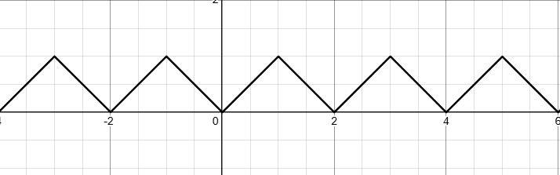
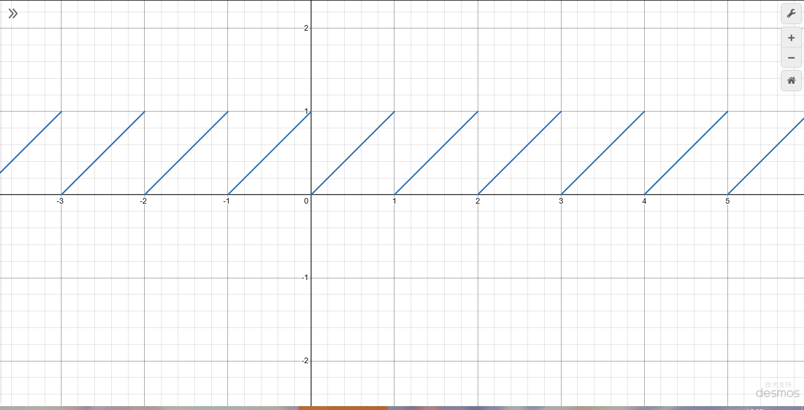
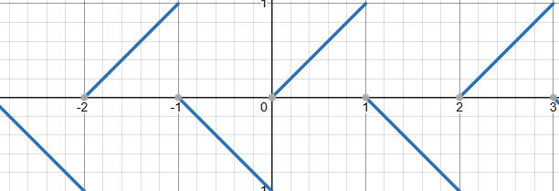

+++
date = "2025-06-04"
draft = false
title = "一种有趣的数学构筑尝试"
image = "title.png"
categories = ["数学"]
tags = ["学习","数学"]

+++

# 一种有趣的数学构筑法

# 一、引言

> 在看到某些分段函数时，其中所蕴含的一种“不够直接”的感觉往往令我感到难受。我们是否能找到一种方式，来用任意一个函数拟合各种特别的分段函数呢？

在必修一的课本上，存在这样一幅函数图像：

​	课本上对于该函数的表达式为：

$$
y=\left|x-2k\right|\left(2k-1<x<2k+1\right)\left(k∈Z\right)
$$

​	

然而，当我们尝试直接在**desmos**中使用这个公式时，我们会遇到这样的问题：

​	让我们来考虑一个问题：**能否不用这种带括号指定范围的分段函数，来实现相同的效果**呢？

​	先看结论！这个函数，写成**这样子**（可以复制到desmos里尝试）：
$$
y = \left(\left(-1\right)^{1+\lceil x \rceil} \cdot \text{mod}\left(x, 1\right)\right) + \left(\text{mod}\left(\lfloor x \rfloor, 2\right)\right)
$$
看上去相当的复杂，对吧？在介绍原理之前，我们可以再举一个例子：统计学的**百分位数**。
$$
P_k = 
\begin{cases} 
x_{\lfloor n \cdot k \rfloor + 1}, & \text{如果 } n \cdot k \text{ 不是整数} \\
\frac{x_{n \cdot k} + x_{n \cdot k + 1}}{2}, & \text{如果 } n \cdot k \text{ 是整数}
\end{cases}
$$
这是它的常规公式。那么，我们能否找到一个**独立**的公式，效果却和百分位数**一模一样**呢？有的兄弟，有的！先看结论：
$$
t = \left( \frac{\lceil | n \times k\% - \lfloor n \times k\% \rfloor | \rceil + 1}{2} \right) \times X_{\lceil n \times k\% \rceil} + \left( \frac{|\lceil \text{mod}(n \times k\%, 1) \rceil - 1|}{2} \right) \times X_{\lceil n \times k\% \rceil + 1}
$$
看上去似乎更加复杂了...那么，我们要如何写出这样的函数呢？让我们先来拆分下上面两个函数的思路！

# 二、逻辑拆分

尽管以上两个公式令人生畏，但其中包含一个清晰的逻辑。让我们对其进行具体分析：

## 1.锯齿函数

观察原图像，我们可以分析一下其具备的规律：

- 在所有的**偶数到奇数**段内，曲线从`0 - 1`上升。
- 在所有的**奇数到偶数**段内，曲线从`1 - 0`下降。

规则很简单，我们要如何着手这个图像呢？既然我们不打算用括号显式的指定**周期函数**，那我们不妨用些现成的周期函数。观察`mod(x,1)`的图像，我们会发现，这和我们的目标很相似：

很显然，这个图像在所有的**偶数到奇数**段完全正确！因此，我们要做的就是把偶数段和奇数段分开处理。怎么做到呢？

这里我们不妨看看另一个函数：`-1^n`。我们都知道，**-1**的**奇数次幂**为-1，**偶数次幂**为1。刚好，我们需要做到的效果是偶数次幂时方向取反。将**偶数到奇数**区段内的数进行**向上取整**会使其变成奇数，反之亦然。在这么做之后多取一个**-1**就可以达到效果！（其实直接向下取整也可以）

那么，我们就得到了第二个关键组件：
$$
\left(-1\right)^{1+\lceil x \rceil}
$$

所得图像如下。

接下来我们要将所有的**偶数**（奇数到偶数）区段+1。简单用一个取模函数加上向下取整即可：
$$
\left(\text{mod}\left(\lfloor x \rfloor, 2\right)\right)
$$
那么，只要将这三个模块组合，就可以达到完整的函数效果。接下来，让我们分析一下第二个函数：

## 2.百分位数

让我们先观察一下百分位数的逻辑：
$$
P_k = 
\begin{cases} 
x_{\lfloor n \cdot k \rfloor + 1}, & \text{如果 } n \cdot k \text{ 不是整数} \\
\frac{x_{n \cdot k} + x_{n \cdot k + 1}}{2}, & \text{如果 } n \cdot k \text{ 是整数}
\end{cases}
$$
为了让式子尽可能的简单，我们来看看存在哪些点可以简化：

- 首先，当`n*k`不是整数的时候，对其进行向下取整再加一完全可以等价于向上取整；
- 如果*n\*k*是整数，n*k的向上取整值不变
- 那么，我们可以把逻辑简化为：一定会取一半的当前位数（指n*k向上取整位置）；如果是整数，就取一半下一位数的值；如果不是，则再取一半当前位数

再完成这样的分析后，再来写式子就简单多了。

首先，我们肯定需要一个基底的一半当前位数：
$$
t = \frac{1}{2} \times X_{\lceil n \times k\% \rceil}
$$
接下来，我们需要得到一个式子用来判断是否具备小数。有两个简单的式子可以达到这个目的：
$$
\lceil x-\lfloor x \rfloor\rceil  \\  \lceil mod(x,1) \rceil
$$
这两个式子具备相同的效果，具体情况是：**在有小数时输出`1`，否则输出`0`**。

我们只要用这个式子的结果乘以一半的**当前位数**的值，再拿式子的结果相反值乘以一半的**下一位数**的值，就可以达成目的了。那么，我们还需要一个取反的式子：
$$
-(x-1)  \\ |x-1|
$$
这两个式子都可以达成完全相同的效果。那么，我们只要把数个模块组装起来，就可以得到最终式子：
$$
t = \left( \frac{\lceil | n \times k\% - \lfloor n \times k\% \rfloor | \rceil + 1}{2} \right) \times X_{\lceil n \times k\% \rceil} + \left( \frac{|\lceil \text{mod}(n \times k\%, 1) \rceil - 1|}{2} \right) \times X_{\lceil n \times k\% \rceil + 1}
$$

## 3.思考范式

通过以上两个例子，我们可以注意到，这种方式可以找到一个共通的步骤：

- 分析原式
- 找到规律
- 找出式子
- 组合

分析原式和找到规律的部分似乎没有什么好用的快速方案，然而，式子中却似乎有很多部分是共通的！那么，我们不妨对常用的式子进行一个提取？

# 三、公式逻辑门

为了更好的运用这些公式进行组装，我们不妨采取一个**统一的接口数字**。那么，我们不妨设为`0和1`。其中，**1**代表**是**，0代表**否**！同时，为了方便，我们可以再取`1和-1`作为第二套逻辑标准。

## 单位转化

那么，当务之急就是先定义出两套标准的转化。我们不妨让0和-1互相转化：
$$
1,0 => 1,-1 : -(-1)^x \\ 1,0 <= 1,-1 :\frac{x+1}{2}
$$
这两串有趣的式子就可以在x值合适的情况下完成转换的工作！接下来，我们再定义出几个有趣的小工具。

## 符号提取

符号提取可以将一个大小任意的数字转化到标准信号的一种之中。我们可以很自然的想到这样的方式：
$$
\frac{x}{|x|}
$$
然而，这个式子不可兼容0 。那么，我们只能采取一个更加复杂的方案：
$$
\lceil( \frac{x}{ (|x|+1)} )\rceil -  \lceil(\frac {-x}{(|x|+1)} )\rceil
$$
不过，在确认输入值 ≠0 的情况下，可以采用第一种方案。

## 提取小数

提取小数可以用这两个简单的公式。同时，如果想表达是否“存在小数”，则进行向上取整即可：
$$
x-\lfloor x \rfloor \\ mod(x,1)
$$

## 非运算

1和-1的非运算再简单不过。我们考虑1和0的非运算：(两式效果相同)
$$
|x-1| \\ -(x-1)
$$

## 与运算

我们同样有多种方法可以实现该效果：
$$
\lfloor\frac{x_1+x_2}{2}\rfloor  \\  x1\times x2
$$

## 或运算

我们可以按照逻辑门的角度考虑：非（（非1）与（非2））即或。或者，我们可以用向上取整：
$$
\lceil\frac{x_1+x_2}{2}\rceil
$$
其实，拥有了以上三种门之后我们可以构筑出更多东西。在此并不一一列举，不过我们可以尝试构筑一下异或：

## 异或运算

我们采用这个逻辑：（1 与 非2）或 （非1 与 2）：
$$
\lceil\frac{[(x1\times-(x2-1))+(x2\times-(x1-1))]}{2}\rceil
$$

## 奇偶切割

我们可以通过以下两种方式将奇数部分和偶数部分切割。其中，前一种方案采取的是`1/-1`编码，后一种采取的是`0,1`编码：
$$
(-1)^{\lfloor x\rfloor+1}  \\  mod(\lceil x\rceil,2)
$$

## 周期性取值

用于在满足**周期n**时取到**值k**:（可以做成周期性添值或者乘值）
$$
k|[mod(\lceil x \rceil,n)]-1|
$$

## 判断大小

判断x是否大于（或小于）某个数k，可以直接将x与k相减，再通过提取符号观察正负即可：
$$
\frac{(x-k)}{|(x-k)|}(x≠0) \\\\ \lceil( \frac{(x-k)}{ (|(x-k)|+1)} )\rceil -  \lceil(\frac {-(x-k)}{(|(x-k)|+1)} )\rceil
$$
如果想要判断是否在一定范围内，判断两次然后用与运算即可。

## 选择器

选择器只要根据条件在两种值中选择一种即可，实现上也非常简单（条件为k，两种情况分别为x1 x2）：
$$
k(x_1)-(k-1)(x_2)
$$

## 多重与&多重或

多重与和多重或只需要用连乘和连加即可：
$$
\prod_{i=1}^{n} x_i  \\ \lceil\frac{1}{n}\sum_{i=1}^{n} x_i\rceil
$$

## 判断数值

要判断x是否等于某个特定的值（k），我们只需要将x-k带进符号判断公式中，并将-1设为1再取反即可：
$$
(|\lceil( \frac{x-k}{ (|x-k|+1)} )\rceil -  \lceil(\frac {-(x-k)}{(|x-k|+1)} )\rceil|-1)
$$

## 区间二分

让x在每个区间k内，将前半段和后半段进行区分（返回值0,1）：
$$
\lfloor\frac {mod(x,k)}{k}+\frac{1}{2}\rfloor
$$

# 四、实战

我们现在可以来快速尝试将上述的内容运用到实战：

## 尝试1：ReLU（线性整流函数）

RuLU函数的基础函数是：
$$
\max(0,x)
$$
我们能否使用上述的内容来完成Relu呢？我们只需要用一个判断函数，在x的前面加上系数：x>0的判断，并将-1转化成0即可（为了实现这个目的，加一再除以2再向下取整）。式子如下：
$$
x(\lfloor\frac{\lceil( \frac{(x-k)}{ (|(x-k)|+1)} )\rceil -  \lceil(\frac {-(x-k)}{(|(x-k)|+1)} )\rceil+1\lfloor}{2})
$$
不过，这种方案是直接套模块得到的，我们还有更简单的方案，不过要具体分析情况得到了：
$$
\frac{(x + |x|)}{2}
$$

## 尝试2：自定义函数

### 场景设定

假设电费按用量分段计费：

- **第一阶梯**（0~100度）：每度0.5元
- **第二阶梯**（100~200度）：超出100度的部分每度0.8元
- **第三阶梯**（>200度）：超出200度的部分每度1.2元

### 分步构造

#### 1. 阶梯区间检测

我们需要三个逻辑信号（1表示属于该区间，0表示不属于）：

- **k₁**（第一阶梯）：x ∈ [0,100]
- **k₂**（第二阶梯）：x ∈ (100,200]
- **k₃**（第三阶梯）：x > 200

**构造方法：**

- 用**符号差+取整**检测边界：

  - $$
    k_1 = \lceil \frac{100 - x + |100 - x|}{2(100 - x + |100 - x|) + 1} \rceil - \lceil \frac{x - 100 + |x - 100|}{2(x - 100 + |x - 100|) + 1} \rceil + 1
    $$

    

  - $$
    k_2 = \text{类似方法检测 } (100,200]
    $$

    

  - $$
    k_3 = \lceil \frac{x - 200}{x - 200 + |x - 200| + 1} \rceil
    $$

    

#### 2. 阶梯费用计算

- $$
   第一阶梯费用：0.5x \cdot k_1\\
  第二阶梯费用：[50 + 0.8(x-100)] \cdot k_2\\
  第三阶梯费用：[130 + 1.2(x-200)] \cdot k_3\\
  $$

  

#### 3. 组合输出

总费用 = 第一阶梯费用 + 第二阶梯费用 + 第三阶梯费用
通过**逻辑门**确保只有当前阶梯信号为1时生效：

$$
\begin{aligned}
\text{Cost}(x) = \ & 
\frac{x}{2} \left( \left\lfloor \frac{A_1}{2A_1+1} \right\rfloor \left\lfloor \frac{B_1}{2B_1+1} \right\rfloor + 1 \right) \\
+ \ & 
\left( 50 + \frac{4(x-100)}{5} \right) \left( \left\lfloor \frac{A_2}{2A_2+1} \right\rfloor - \left\lfloor \frac{B_2}{2B_2+1} \right\rfloor  k_1 + 1 \right) \\
+ \ & 
\left( 130 + \frac{6(x-200)}{5} \right) \left\lceil \frac{x-200}{C+1} \right\rceil
\end{aligned}
$$

$$
\begin{aligned}
A_1 &= 100 - x + |100 - x|, \quad B_1 = x - 100 + |x - 100| \\
A_2 &= 200 - x + |200 - x|, \quad B_2 = x - 200 + |x - 200| \\
C &= x - 200 + |x - 200|, \quad k_1 = \left\lfloor \frac{A_1}{2A_1+1} \right\rfloor - \left\lfloor \frac{B_1}{2B_1+1} \right\rfloor + 1
\end{aligned}
$$

# 五、总结

这种方法看上去会将简单的函数大幅复杂化，最终得到一个尽管效果相同但式子复杂上许多，但成功消灭了括号和具体的“规则”的式子。同时，这种思维方式相当系统化和模块化，可以实现一种有趣的自由组装的效果，类似于程序一样。

希望这种方法能够具备一定的参考价值！
