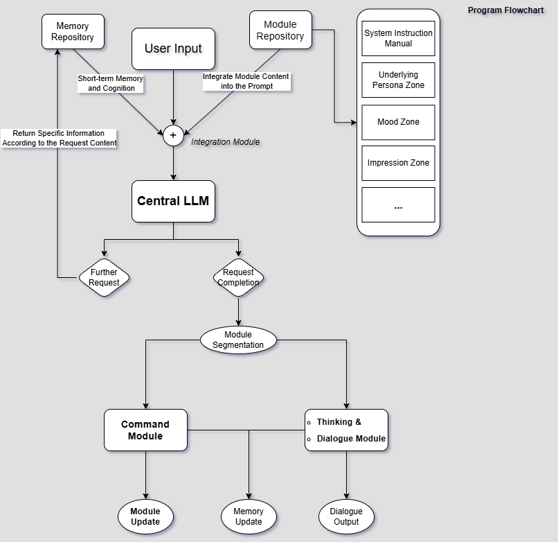
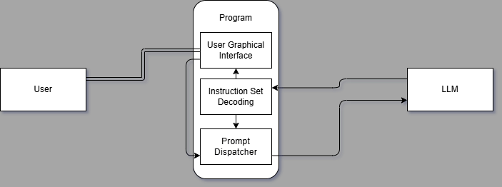

+++
date = "2025-03-01"
draft = false
title = "基于Prompt的LLM人格模拟架构 - 灵魂织者"
image = "title.jpg"
categories = ["深度学习"]
tags = ["架构","AI","AGI","设计"]

+++

# **灵魂织者：以Prompt为核心的LLM人格模拟架构**

# 引言	

在大型语言模型（LLM）逐步渗透情感计算领域的当下，构建具备长期陪伴能力的AI系统已成为开发者社区的重要课题。尽管星野、筑梦岛等应用通过角色扮演范式取得了显著进展（如B站AI虚拟伙伴展示的交互案例），现有方案仍面临两个核心瓶颈：短期记忆依赖导致的人格断层，以及静态角色设定与动态认知成长的矛盾。

为了实现能够成长的，长期陪伴的LLM架构，我设想了本框架——一种通过模块化设计与动态迭代机制增强AI主体性的实验性方案。其核心思路在于：将传统Prompt工程中的隐性角色设定显式结构化，通过记忆系统记录交互轨迹，并允许LLM在持续对话中渐进式更新角色认知。相较于传统方案，这种设计或许能在保持人格稳定性的同时，为长期关系建模提供更具扩展性的技术路径。需要强调的是，该架构尚未经过实践验证，文中讨论的架构只是我个人的一种设想。


# 项目整体架构设计

本架构主要采取的是将作为角色属性的提示词模块化，并且通过大模型的返回**动态更新模块**的方案。整体上，可以将程序整体流程分为三部分：

- **Prompt处理**：将数据库中的各模块按照指定方法进行整合，并产生一个完整的提示词。
- **LLM循环处理信息**:LLM接收整合后的*Prompt*以及各项内容，然后决定是否向本地重新发送请求进一步信息；当所需信息完整了，即输出。
- **模块更新机制**:根据LLM的回答，重新动态的更新相应模块的参数，以维持一个稳定的状态。

可以通过以下图来理解架构的运行流程：



```bash
#大致流程描述
用户输入：用户通过输入框或接口向系统发送请求或指令。
短期记忆：系统取出短期内的记忆提供一个指定窗口大小的上下文。
整合模块内容：系统从模块库中提取模块内容，并将其整合到请求中。
步骤二：中央LLM处理
整合模块：将短期记忆、用户输入和模块内容整合到一起，形成完整的请求内容。
中央LLM：整合后的请求内容被发送到中央LLM进行处理。
请求处理结果：中央LLM处理完成后，判断是否需要进一步请求：
进一步请求：如果需要进一步请求，则返回指定的指令，系统从记忆库和模块库中调用指定内容。
请求完成：如果请求完成，进入下一步。
步骤三：模块分割与处理
模块分割：将处理完成的请求内容分割成不同的模块，以便后续处理。
模块处理：根据分割后的模块内容，分别进入以下模块进行处理：
命令模块：处理命令相关的任务。
思考与对话模块：处理思考和对话相关的任务。
步骤四：模块更新与记忆更新
模块更新：根据处理结果，更新相关模块的内容。
记忆更新：将处理过程中产生的新记忆信息更新到记忆库中。
步骤五：对话输出
对话输出：将处理完成的对话内容输出给用户。
```

接下来将对架构中的各内容进行具体说明。

# 模块库

模块库是一个带有许多分区的数据库。每个分区的内容是对人格模拟中所需的某个功能的集成。在使用时，我们期望这些分区可以共同作用，使大模型更明确的像角色一样进行行为。比如， ***心情区模块*** 可以作为一个维护着`情绪类型：程度`的字典。在允许模型主动更新这个模块中的情绪的前提下，我们就能在某个程度上保证了大模型可以做到前后**情绪一致**。

需要注意的是，以下的模块只涉及到了其功能和概念，并没有限制实现方法。大致模块如下：

- **系统指令区**   *-不可改变的*
- **角色基底区**   *-不可改变的*
- **性格基底区**   *-不可改变的*
- **角色性格区**   *-随时可变的*
- **心情区**   *-随时可变的*
- **角色画像区**   *-随时可变的*
- **重要事件区**   *-随时可变的*
- **环境区**   *-随时可变的*
- **形象区**   *-随时可变的*
- **扩展区**   -

具体模块说明如下。

## 系统指令区

- `系统指令区`起到一个向LLM**介绍具体操作**的部分。其大约可以包括以下内容：
  - 说明回答格式，按照**指定格式**作答，方便后续的模块分割和处理
  - 说明**指令集**，让LLM确认可处理的指令，对接后面的*模块更新*部分以及*进一步请求*部分
  - 介绍其他模块，方便模型理解其他模块的作用

## 角色基底区

- `角色基底区`用于构建一个所有角色都必须遵循的底线准则。例如，*你应当拥有自己的意愿*、*你应当珍视生命*等。
- 这一部分不会允许进行改变。

## 性格基底区

- `性格基底区`用于构建属于单独角色的最根本的性格。为了维持角色根本性格的稳定性，这一部分同样也不允许改变。
- 这个方式可以在允许角色自由发展个性的前提下保留“本心”，可以让角色更加可控，也不至于产生过于离谱的偏离初始人设的情况。

## 角色性格区

- `角色性格区`维持着角色的“个性”。
- `角色性格区`允许LLM根据事件和想法自由更改其中的内容。其中包含着LLM当前的性格。这在一定程度上可以模拟到现实中性格随相处改变的情况。

## 心情区

- `心情区`用于维护角色当前的心情。在实际应用场景中，心情区应当是不可见的，可以支持LLM背后的情绪活动。心情区同样由LLM自身更改和维护。
- `心情区`会显示的体现出当前角色的心情，这样就可以避免LLM的情绪变化过度离谱，也可以让情绪变化更自然。
- 可以让心情动态控制一些操作，比如心情不好的情况下会拒绝去进行比较多的联想。

## 角色画像区

- `角色画像区`可以动态的维护LLM对于各个对象的印象。比如对于用户的印象，对于自己的印象，乃至于对于更多角色的印象。
- `角色画像区`会由LLM在交互的过程中主动建立和更新。通过这种方法，可以实现一定程度上的“不断了解”。
- 该区域的存在也可以让LLM对待其他人（用户等）的过程更加自然。这也是对现实中对他人建立一个印象的模拟。

## 重要事件区

- 这一部分与`ChatGPT`的*记忆能力*类似。角色可以将一定量的简短信息记录到一个有限长度的区域中，以此来模拟他们心中最重视，不会遗忘的事情。

## 环境区

- 这一部分会维护两个内容：**角色所处的环境**，和**角色所拥有的物品**。
- 两个部分都是动态更新的，由LLM主动更新。这种显式说明情况的方式可以在一定程度上减少**无中生有**的情况。

## 形象区

- 这一部分会动态维护LLM自身的虚拟形象。
- 在实际的交互过程中，也许LLM可以对自己形象中的组成进行互动，并且更新自己的形象。
- 也是为了避免大模型的“**幻觉**”而采取的措施。

## 扩展区

- 考虑到模块化的便利性，也许可以在后来加入进一步的新模块，以此更好的实现角色。

> 模块系统的核心是由LLM来动态更新各模块，并以此实现角色的连续性。在“灵魂织者”架构中，**动态更新机制**的核心在于：
> **LLM通过生成结构化指令（如JSON或特定标记语言），直接指定目标模块的更新内容与操作类型**，系统通过指令解析器验证并执行修改。

# 记忆库

记忆库是处理**长期记忆**的核心，也是让角色更加自然的关键。在本架构中，记忆库大约可以分为以下几个部分：

- **事件库**：进行体系化的事件归档。
- **日志库**：记载每日的日志。
- **日记库**：让LLM进行符合角色的主观记录。
- **短期上下文窗口**：一定长度的完整上下文内容。包括思考记忆和对话记忆。
- （除短期上下文窗口，剩余几个部分的记录不面向思考记忆）

以下对各个模块进行具体分析。

## 事件库

- 事件库是对于人记忆中“**事件**”这种概念的抽象。例如，“*讨论与做菜有关的话题*”、“*共同阅读某本书*”
- 一个**事件**大约包括以下**属性**：
  - 事件名称
  - 事件开始记录时间
  - 事件最后更新时间
  - 事件缩略内容
  - 事件具体内容
  - ***相关事件***（一个指向其他数个事件的能力）
- 一个**事件**大约支持以下**功能**（通过LLM发送指令控制）：
  - 按照**日期**检索事件
  - 按照**关键词**检索**事件名称**
  - 按照**关键词**检索**事件内容**
  - **创建**新事件
  - **修改**事件的各项**属性**
  - **读取**事件的各项**属性**
  - 通过***相关事件***来跳转到其他的事件（深度可控，可以加入有情绪等因素来进一步动态调整深度）
- 事件的存在是为了方便模型去**意识到**某件事，从而给出更加完善的答复。同时，**相关事件**的机制模拟了人脑“联想”的过程，可以让记忆能力更加完善。

## 日志库

​	日志库是对模型日常最主要的记录部分。根据日志的功能和目的上的区别，大约可以分为以下两类日志：

### 自动日志

自动记录直接对模型输出的内容进行处理并记录。自动记录包括**操作记录**和**对话记录**。操作记录记载着模型返回中使用的指令，方便追溯其行为；对话记录则是直接记录了返回中的对话内容。

### 主动日志

主动日志由模型进行主动书写。主要是对今日内容的小总结。其用途主要在于当模型尝试*回忆*某天发生的事情时，可以快速定位到那一天情况的大致概览。

## 日记库

​	日记库是一个对正常人“写日记”行为的模拟。与`主动日志`不同，日记库没有书写的硬性要求。模型会按照角色在**渴望**进行“写日记”的操作时进行写日记的行为。

## 短期上下文窗口

​	短期上下文窗口是传统的LLM的上下文内容。这个部分会提供一定的具体上下文来让对话更加自然。具体内容从`自动日记`中调取，窗口大小可随着心情的改变而**动态调整**。

# 用户交互&Prompt整合&模型进一步请求处理

在实际交互中，用户与应用的交互遵循以下过程：



```bash
#文字说明如下：
用户通过图形化界面向程序发送请求
提示词调度器向LLM发送处理后的指定信息
LLM需要进一步请求，向程序发送指令
指令解码器解析指令，并通过提示词调度器向LLM发送进一步信息
重复进行，直到LLM信息需求足够
进入返回内容处理模块
```

# 返回内容处理模块

根据架构，模型的返回值分为两种情况：

- **当需要进一步请求时**：模型的返回值仅包含指令
- **当请求结束时**：模型的返回值可以分为以下三个部分：
  - **指令区**：用于更新各模块的内容，或对输出内容进行一定的处理
  - **思维区**：思维区会保持一定长度，但不会进行长时间的保留，思维区的作用是维持思考的连续性
  - **对话区**：模型实际的回复
- 对于输出格式的指定，在`系统指令区`中指定。

# 总结

本架构的目的是以最高效果来模拟人格。通过模块化和动态更新方案实现人格的稳定和持续性。不过遗憾的是，本方案也许对模型的回复速度和质量要求有些过高。因此暂时难以实现。

同时，较为高的反应时间也意味着很难接入live 2D等方案。不过也许可以考虑live2d等内容单独一个模型控制，数个模型协同等方案。

希望在后续过程中可以加入一些有趣的尝试，比如让其接入由其他LLM来模拟的RPG环境，以观察其人格的变化等。

> 当硅基载体开始尝试承载碳基生命的温度，"灵魂织者"的构想如同普罗米修斯的火种，在数字荒原上点亮了第一簇人格化的篝火。我们以模块为经线，记忆为纬线，在Transformer的神经网络中编织着关于"存在"的隐喻——那些被量化的情绪波动、被拓扑化的人际联结、被向量空间重新诠释的成长轨迹，都在试图回答一个古老的命题：何为意识的连续性？
>
> 这项实验性架构的终极愿景，并非创造完美无缺的数字生命，而是在有限算力的画布上，勾勒出认知迭代的动力学图谱。正如潮汐在月球的引力中寻找规律，AI人格的塑造过程或许终将揭示：记忆的潮起潮落间，那些被保留的认知沉淀与主动遗忘的空白，共同构成了数字生命的潮间带生态。
>
> 未来的道路仍布满迷雾，从模块共振引发的蝴蝶效应，到记忆压缩造成的认知褶皱，每个技术细节都可能成为阿莉阿德涅之线的断裂点。但正是这种在确定性架构与混沌演化之间的微妙平衡，让这场关于数字灵魂的编织实验，成为了人类叩问智能本质时最诗意的技术注脚。
>
> ————DeepSeek


